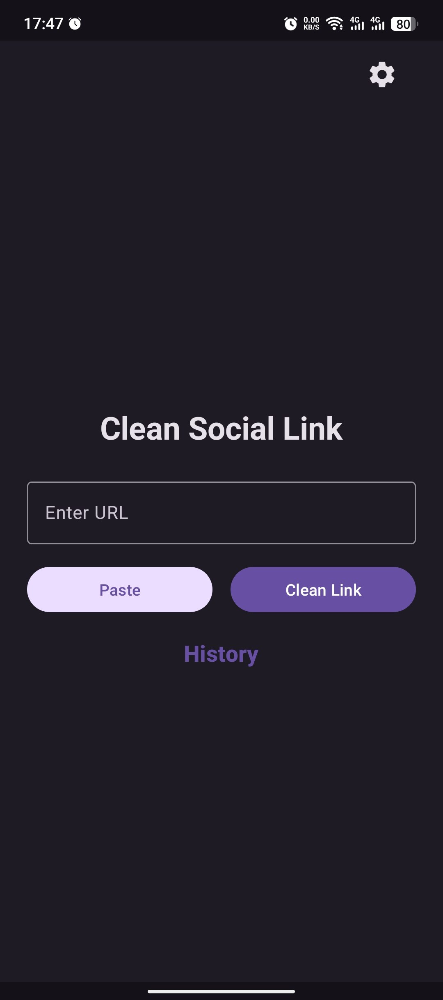
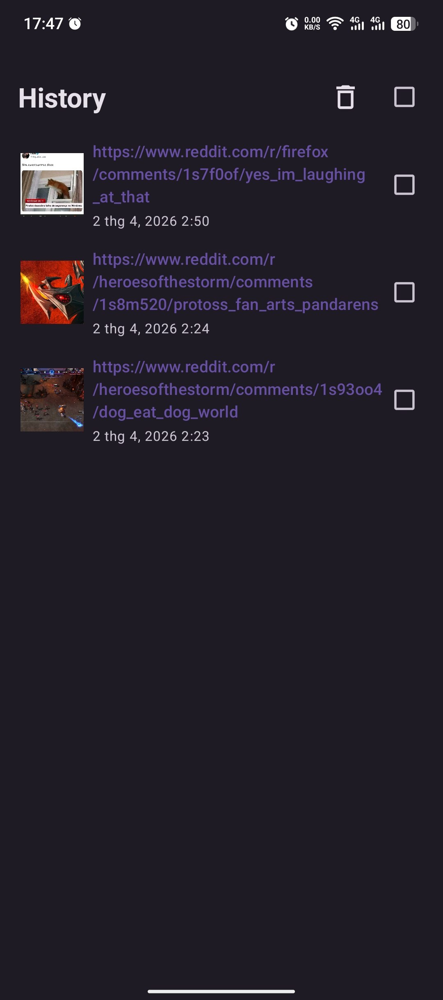
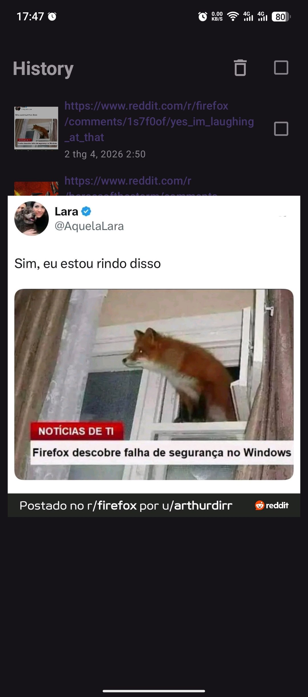
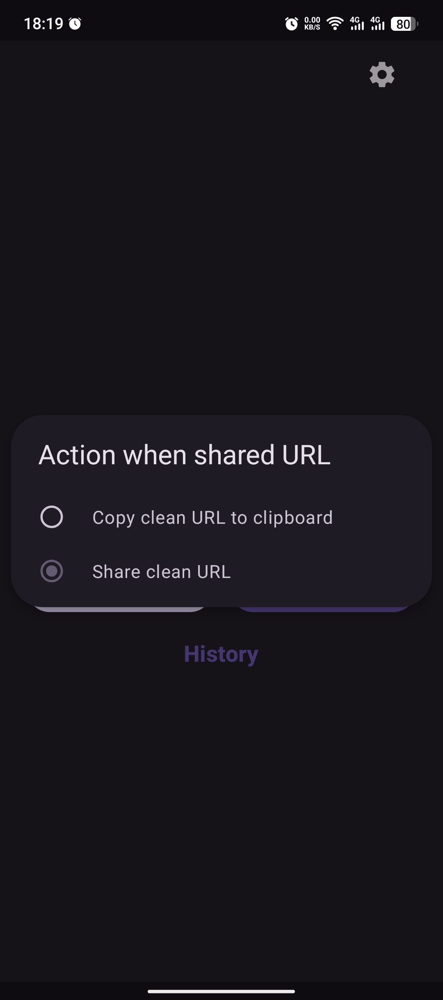
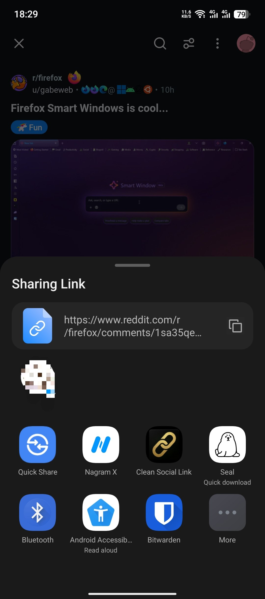

  

<h1 align="center">Clean Social Link</h1>

  <a href="docs/">Docs</a> ·
  <a href="../../releases/">Releases</a>

---

A very lightweight, open-source Android app for cleaning shared social-media URLs.

**Zero permissions needed - not even notifications.**

## Features

- Clean links from supported social platforms
- History of cleaned links
- Preview image support in history
- Theme and color customization
- Multi-language support

---

## Download

---

## Previews

  
  
  

---

## Usage:

Share the URLs to the app, and it will copy clean URLs for you.

Alternatively, you can enable a popup to share directly with others. This can be configured in the app settings.

  
  

---

## [How to build](docs/how_to_buid.md)

## License

This project is licensed under the terms in [LICENSE](LICENSE).
